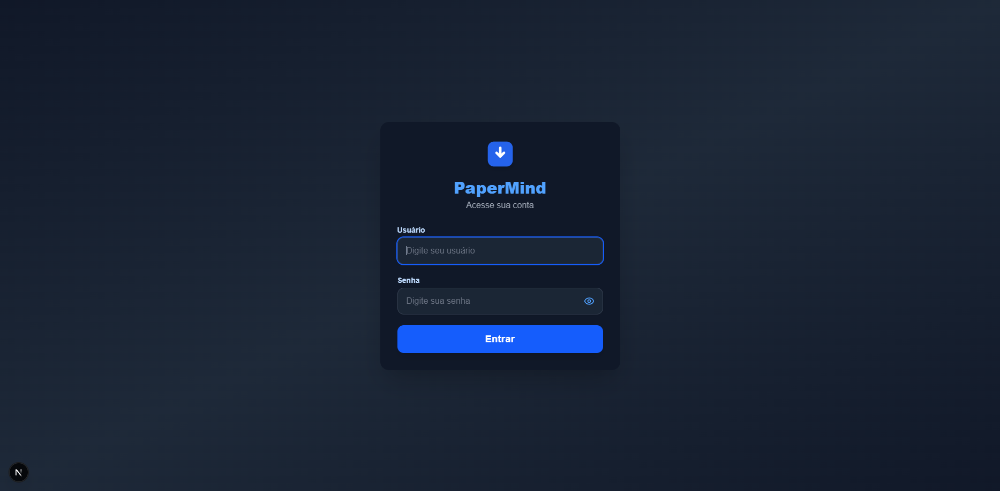
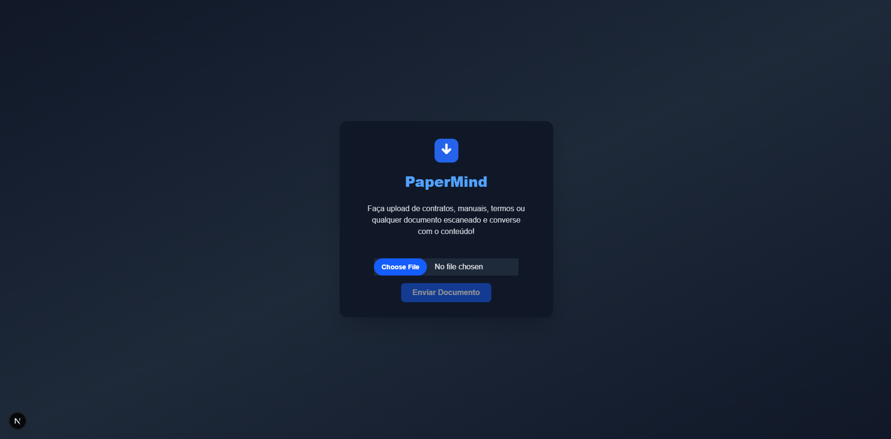

# PaperMind 1.0  
PaperMind é um assistente inteligente capaz de ler, compreender e responder perguntas sobre imagens enviadas. Combinando OCR e IA generativa, ele permite consultas rápidas e precisas aos seus arquivos.

✨ Funcionalidades  
📄 Upload de imagens

🔍 Extração automática de texto via Google Vision OCR

💬 Chat com respostas baseadas no conteúdo dos documentos

🎯 Retorno do trecho original do texto como evidência

🛠️ Tecnologias Utilizadas
Backend
    Python + FastAPI

    Google Vision API para OCR

    OpenAI GPT API para geração de respostas

Frontend
    Next.js (React framework)

    Tailwind CSS para estilização

🚀 Como Executar Localmente  
Pré-requisitos
```bash
    Python 3.10+

    Node.js 18+

    Conta na OpenAI com chave de API

    Conta no Google Cloud com chave da Vision API
```
1. Clone o repositório
```bash
git clone https://github.com/GuiEzzz/PaperMind.git
cd PaperMind
```

2. Configure variáveis de ambiente  
📁 backend/.env:

```env
OPENAI_API_KEY=sk-...
GOOGLE_CREDENTIALS=credentials.json
```

📁 frontend/.env.local:

```env
JWT_SECRET=...
LOGIN_USER=...
LOGIN_PASS=...
```

💡 Você pode obter o arquivo credentials.json no console do Google Cloud.

3. Instale e execute o backend
```bash
cd backend
python -m venv venv
source venv/bin/activate # Windows: venv\Scripts\activate
pip install -r requirements.txt
uvicorn main:app --reload
```

4. Instale e execute o frontend
```bash
cd ../frontend
npm install
npm run dev
```


📸 Capturas de Tela  
Login 


Upload do documento 



🧩 Extensões Futuras
Suporte a múltiplos arquivos

Classificação automática de documentos

Autenticação de usuários

Armazenamento em banco de dados

📄 Licença
Este código é fornecido apenas para fins educacionais e pessoais.
É proibido o uso comercial sem autorização expressa do autor.
© 2025 Gui Enz
